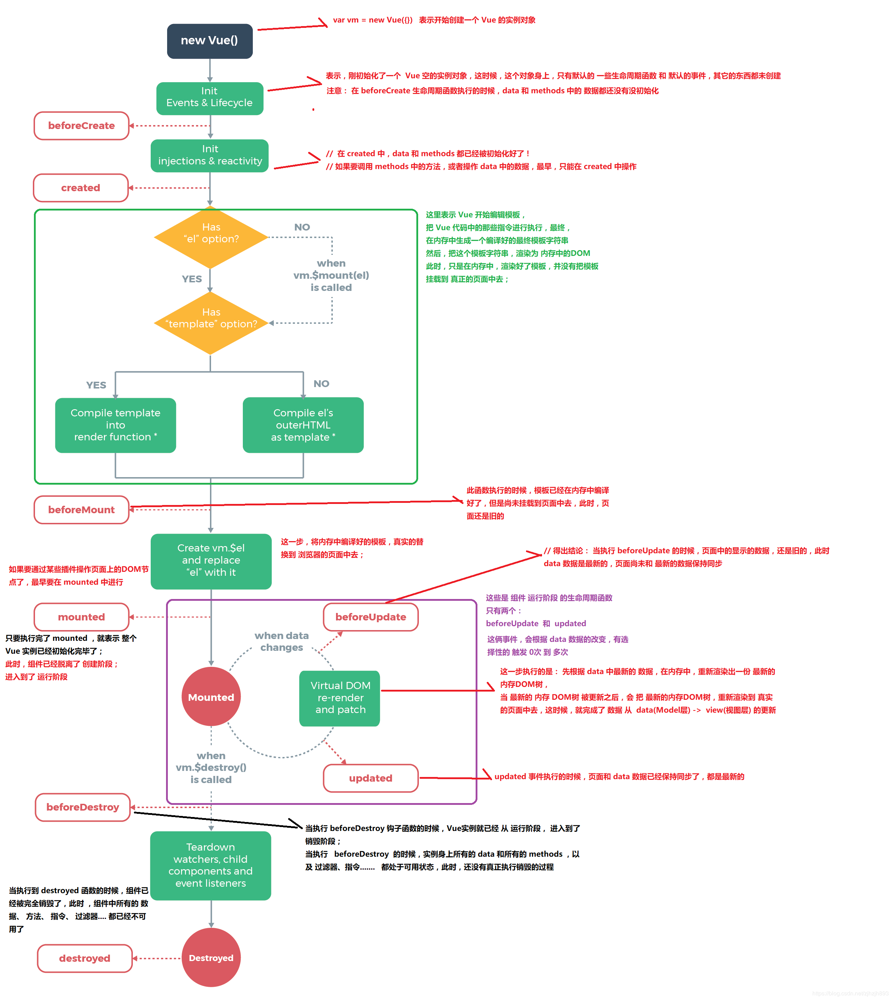

# CSS

## 什么是BFC？

Block Formatting context 的英文拆解

- Block：Block-level Box 指的是块级盒子标准

- Formatting context: 块级上下文格式化，他是页面中的一块渲染区域，并且有一套渲染规则，它决定了其子元素将如何定位，以及和其他元素的关系和相互作用

BFC是指一个**独立的渲染区域，只有Block-level Box参与，它规定了内部Block-level Box如何布局，并且与这个区域外部毫不相干**

它的作用是**在一个独立区域，让BFC内部的元素与外部的元素相互隔离**

 

# 框架基础

## 什么是Virtual Dom?

Virtual Dom 是所有js框架的基础，他是轻量级的对真实Dom的描述，它是真实Dom的抽象。众所周知，前端渲染性能主要的问题在于操作真实Dom ，为了提高性能，需要尽可能少的使用真实Dom操作，virtual Dom 就是为了这点出现的

## Virtual Dom 的核心？

+ 对真实Dom的描述方法 
  + Dom 的创建
  + Dom Tree 的创建
+ 将虚拟dom 转化为真实dom的方法
  + 判断哪些节点需要更新（局部更新）

## 什么是数据劫持？

就是监听一个对象数据的变化，当数据发生改变时立刻获取到通知

## Vue的数据劫持怎么实现的？

通过Object.defineProperty() 来进行添加set get 方法劫持data的变化。

未来vue将用proxy 来代V替Object.defineProperty() 

## Proxy和Object.defineProperty() 区别？

Proxy 是es6 提出的js对象拦截方法，外界在对对象进行访问时进行拦截，因此提供了这个机制。proxy，意思为代理，意在表现它“代理”了某些操作

- Proxy可以监听到数组变化，而defineProperty 不行
- Proxy直接监听对象，而不是属性

## 路由实现原理？

### hash路由

- 主要通过浏览器 onload 事件和 onhashchange 事件，监听url变化和页面刷新，来记录和响应 hash变化

### history路由

- 主要通过html5 提供的History Api ，主要由pushState，forword，back 等方法操作浏览器历史记录实现路由

### 两者区别

- hash路由有会在url 中有一个“#”存在，history路由更像传统页面。没有“#”存在

- hash路由不需要额外服务器部署支持，history路由需要服务器在任意页面响应相同页面，否则直接输入地址会返回404！

# React

## setState 是同步的还是异步的？

结论：在合成事件和钩子函数中是异步的，在原生事件和setTimeout 中是同步的。

原因：

- 合成事件和钩子函数中 都对setState进行了优化（只接受最后一次赋值）

- 原生事件 直接触发了 setState 在performSyncWork 中更新，所以可以同步拿到this.state.xxx 的值

- setTimeout 则是因为js事件循环（宏任务总在微任务后执行的特点）可以直接同步到最新 this.state.xxx 的值

## react 生命周期

### react v16以前

| [mount]            | [updation]                | [unmount]            |
| ------------------ | ------------------------- | -------------------- |
| constructor        | componentWillReceiveProps | componentWillUnmount |
| componentWillMount | shouldComponentUpdate     |                      |
| componentDidMount  | componentWillUpdate       |                      |
|                    | componentDidUpdate        |                      |

### react v16.4 以后

- 变化原因：react 引入了 react-fiber 新增了异步渲染的功能。

| [mount]                      | [updation]                    | [unmount]            |
| ---------------------------- | ----------------------------- | -------------------- |
| constructor                  | **getDerivedStateFromProps**  | componentWillUnmount |
| **getDerivedStateFromProps** | ~~componentWillReceiveProps~~ |                      |
| ~~componentWillMount~~       | shouldComponentUpdate         |                      |
| componentDidMount            | ~~componentWillUpdate~~       |                      |
|                              | **getSnapShotBeforeUpdate**   |                      |
|                              | componentDidUpdate            |                      |

- 因为支持异步渲染的原因，原生命周期componentWillMount componentWillReceiveProps componentWillUpdate 将可能重复调用，所以官方移除了这些生命周期。
- 为了补充 componentWillReceiveProps  componentWillMount  老的生命周期添加了 **getDerivedStateFromProps** 钩子，负责将props 导出到 state

### 为什么要用react-fiber?

大型react应用中每次渲染页面都是同步的（v16以前），而且js是单线程的，如果渲染页面占用了大量时间会导致用户直接操作（输入框）的动作被卡住，必须等待渲染完毕后才能执行输入这个动作。这大大影响了用户的体验，react-fiber 就为了这个而生

# Vue

## vue 生命周期

| [mount]       | [update]     | [destory]     |
| ------------- | ------------ | ------------- |
| beforeCreate  | beforeUpdate | beforeDestory |
| created       | updated      | destoryed     |
| beforeMounted |              |               |
| mounted       |              |               |

